# TextileHub — B2B Textile Marketplace

A B2B marketplace prototype connecting textile **buyers** and **suppliers** — discover fabrics,
compare pricing and MOQ, place bulk orders, and track fulfillment end-to-end, with an AI
assistant that searches live inventory instead of giving canned answers.

## Live Demo

- **Client:** https://hubtextile.vercel.app
- **Server API:** https://textilehub-server.vercel.app

### Demo accounts

| Role     | Email                          | Password    |
|----------|---------------------------------|-------------|
| Buyer    | demo.buyer@textilehub.com       | Demo@1234   |
| Supplier | demo.supplier@textilehub.com    | Demo@1234   |
| Admin    | demo.admin@textilehub.com       | Demo@1234   |

Buyer/supplier accounts are pre-onboarded with real seeded orders/products, so you can log in and
explore immediately instead of registering from scratch. The demo login buttons on the `/login`
page fill these in for you. The demo admin is a protected account — no admin (including itself)
can suspend it or change its role, so it always stays available for grading/demo purposes.

## Screenshots

| Homepage | Product Detail |
|---|---|
| 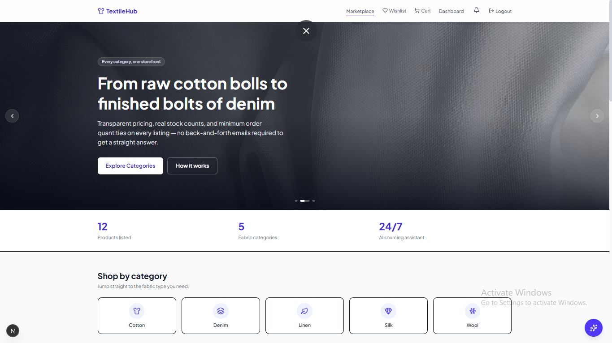 | 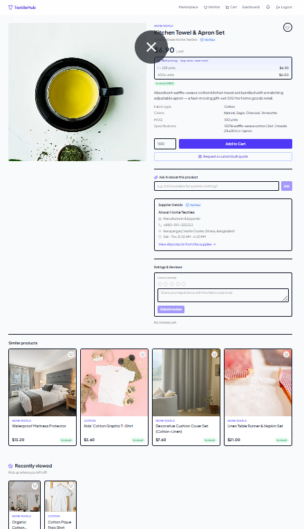 |

| New Arrival | Best Seller |
|---|---|
| 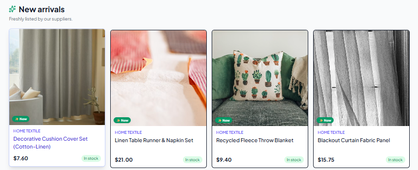 | 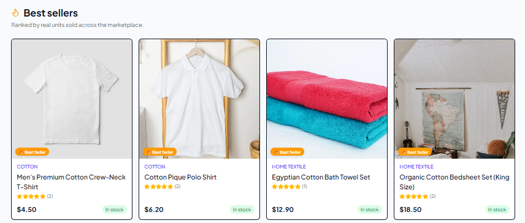 |

| Buyer Dashboard | Supplier Dashboard |
|---|---|
| 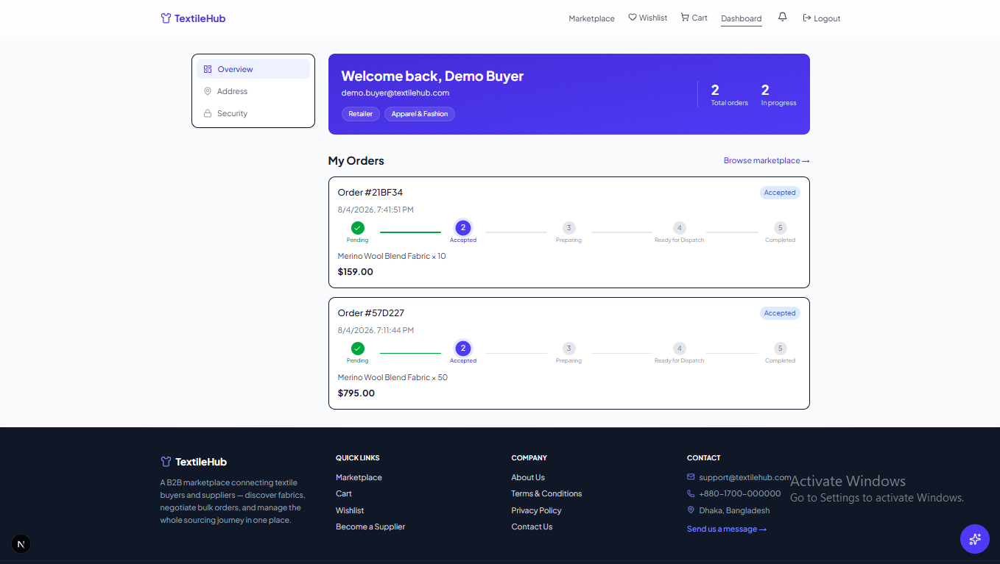 | 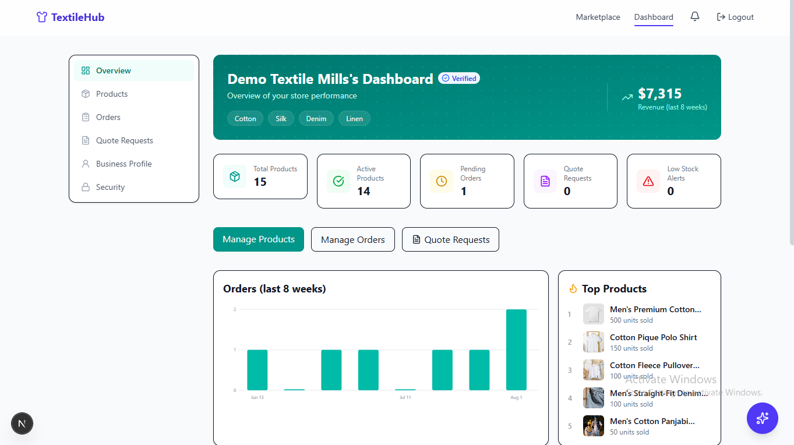 |

| Admin Dashboard | AI Assistant on Onboarding |
|---|---|
| 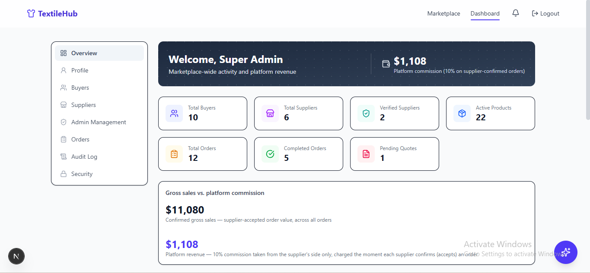 | 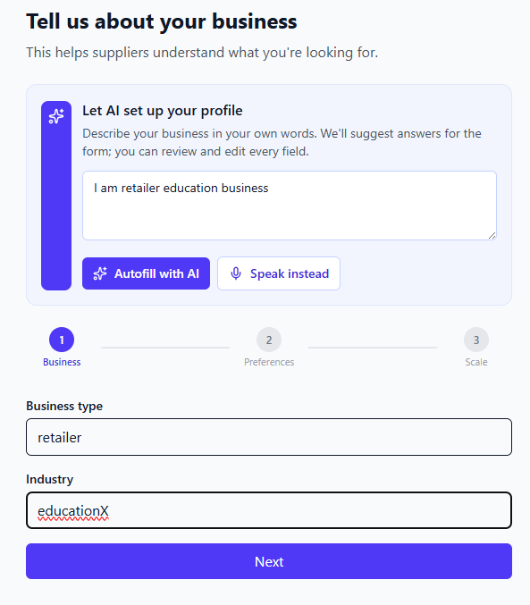 |

| Quote Request | Recently View Products |
|---|---|
| 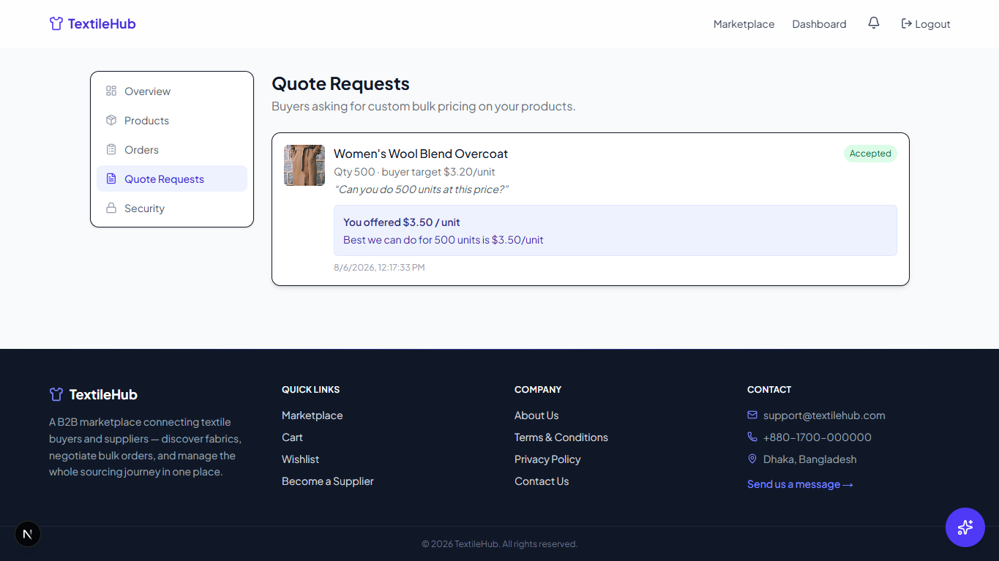 | 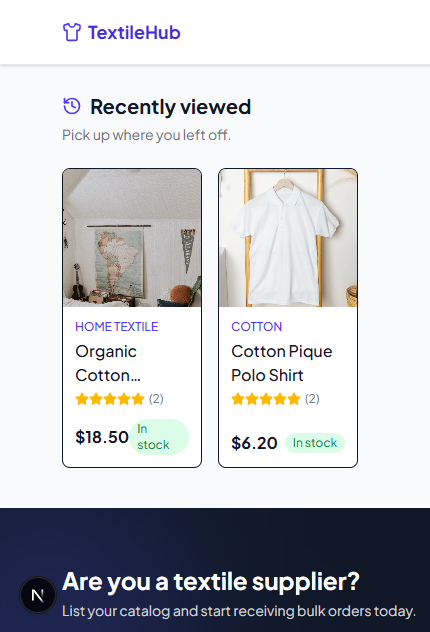 |

| AI Assistant | Cart & Checkout |
|---|---|
| 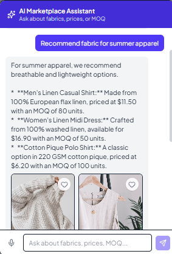 | 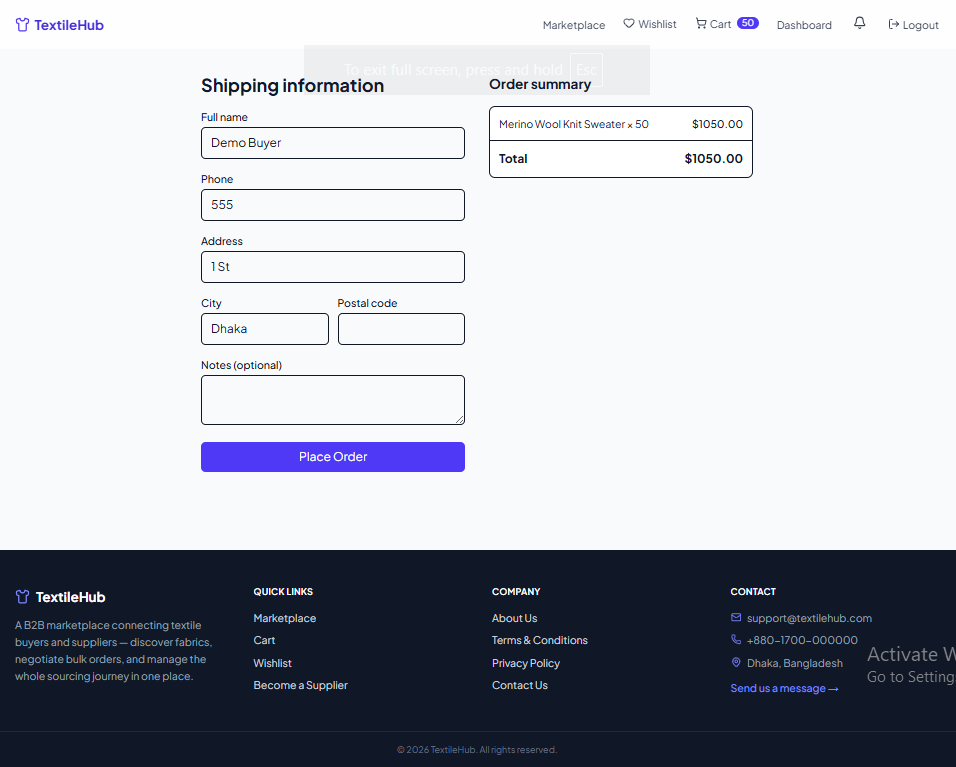 |

---

## Features

### Buyer
- Register/login with email verification, forgot/reset password (email via Nodemailer)
- Multi-step onboarding wizard (business type, categories, fabric preferences, order scale), with
  an optional "Let AI set up your profile" step — describe your business in your own words (typed
  or by voice) and the AI drafts the form fields for you to review and edit
- Editable profile page (name/business details) separate from onboarding, reachable anytime from
  the dashboard sidebar
- Marketplace discovery: search, category/price filters, pagination, "shop by category" grid
- Product detail: multi-image gallery with lightbox, available colors, supplier details card,
  ratings & reviews, same-category "similar products", AI Q&A about the specific product, and
  bulk-pricing tiers (per-unit price adjusts automatically for the quantity you enter)
- Wishlist (heart-toggle on any product card, dedicated page + dashboard link)
- "Recently viewed" row on the homepage and product pages — scoped to your own account, so
  switching accounts on the same browser never shows someone else's history
- Compare up to 4 products side-by-side with an AI-written comparison
- Request a custom-price quote (RFQ) on any product — a lightweight negotiation thread separate
  from checkout — then track the supplier's response and accept/decline it from the dashboard
- Browse a supplier's public storefront: verified badge, aggregate rating, and full catalog
- Cart & checkout with stock/MOQ validation (rejects over-stock quantities with a toast) —
  purchasing is buyer-only; admin and supplier accounts can browse the catalog but can't add to
  cart, request quotes, or check out (enforced both in the UI and on the API)
- Order tracking with a visual status stepper (Pending → Accepted → Preparing → Ready for
  Dispatch → Completed) and in-app notifications on status changes
- Dashboard: order history, saved address, password change, wishlist, quotes — all behind a
  responsive sidebar (desktop) / tab bar (mobile)

### Supplier
- Product CRUD with multi-image upload (Cloudinary), at least one color required per product,
  stock/MOQ management, and bulk-pricing tiers
- Quick +/- stock adjustment directly from the product list (no modal needed)
- Incoming order management with status updates (triggers buyer notifications)
- Respond to incoming buyer quote requests (RFQ) with a custom price and message; buyer is
  notified and can accept/decline
- Dashboard with live stats (products, pending orders, low-stock alerts) and an 8-week
  orders/revenue chart — its own **teal** accent theme (sidebar, banner, chart) so it reads as
  visually distinct from the buyer's indigo and the admin's slate
- Verified-supplier badge (shown on product pages, the public storefront, and the dashboard)
- Platform commission: a 10% fee is charged on the supplier's side only (never added to the
  buyer's price) the moment the supplier confirms (Accepts) an order — the dashboard breaks down
  confirmed gross sales vs. platform fees paid vs. net revenue
- Editable business profile page, separate from onboarding

### Admin
- `/dashboard/admin`, route-guarded to the `admin` role; public registration only ever creates
  buyer/supplier accounts — admins exist only via seeding or being promoted by another admin
- Overview: marketplace-wide stats (buyers, suppliers, verified suppliers, active products,
  orders, pending quotes) and platform revenue — the 10% commission total, computed across *all*
  orders including ones seeded/placed before the admin dashboard existed, not just new ones
- Buyer & supplier management: search, suspend/reactivate (with an optional reason shown to the
  user, blocks login and any active session), and verify/unverify suppliers — all through a
  styled confirm dialog, not a browser popup
- Admin management: list every admin and change anyone's role (buyer ⇄ supplier ⇄ admin) — any
  admin can do this to any other account, **except** the seeded demo admin, which is protected
  and can't be suspended or role-changed by anyone (including itself), keeping the demo login
  always available
- Global order list (with per-order platform fee) and a full audit log of every sensitive admin
  action (who did what, to whom, when)

### AI Marketplace Assistant
- Powered by Google Gemini (`gemini-2.5-flash`)
- Floating chat widget with natural-language search + voice input, grounded only in live DB data
- Personalized recommendations from the buyer's onboarding profile
- Product Q&A and side-by-side comparison, both backed by real product records — never invented
- Same AI engine also powers the optional onboarding autofill (see Buyer/Supplier onboarding above)

### Platform-wide
- JWT access + refresh token rotation (httpOnly refresh cookie); session survives a full page
  reload on any screen — you stay put instead of being bounced to the login page
- Three roles (buyer / supplier / admin) with server-side `requireRole` guards on every
  role-restricted endpoint, not just UI-level hiding; suspended accounts are blocked at login and
  mid-session
- Toast notifications (bottom-left), skeleton loaders, styled confirm dialogs (suspend/verify/
  role-change use an in-app dialog, not `window.confirm`/`prompt`), responsive design throughout
- Footer with quick links, About Us, Terms & Conditions, and Privacy Policy pages

---

## Tech Stack

**Frontend** — Next.js (App Router) · Tailwind CSS · React Hook Form + Zod · Zustand · lucide-react

**Backend** — Node.js + Express · MongoDB + Mongoose · JWT (access + refresh) · Cloudinary ·
Nodemailer · Google Gemini (AI assistant + onboarding autofill)

**Deployment** — Client on Vercel; server supports both a traditional Node process (Render/Railway,
via `server.js`) and Vercel serverless functions (via `api/index.js` + `vercel.json`).

---

## Repository Structure

```
project-root/
├── client/     # Next.js + Tailwind CSS (frontend)
├── server/     # Express.js + MongoDB (backend)
└── docs/       # README assets (screenshots)
```

## Local Setup

### Server

```bash
cd server
cp .env.example .env   # fill in your own MongoDB/Cloudinary/Gemini/Gmail credentials
npm install
npm run seed:demo      # optional: creates the demo admin/buyer/supplier + sample catalog
npm run dev            # http://localhost:5000
```

### Client

```bash
cd client
cp .env.example .env.local   # set NEXT_PUBLIC_API_URL to your running server
npm install
npm run dev             # http://localhost:3000
```

See each folder's `.env.example` for the full list of required environment variables.

---
